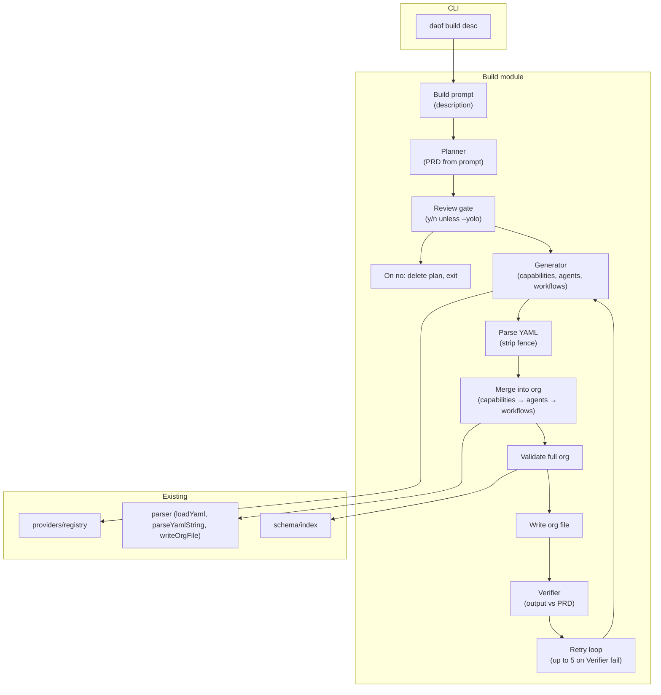

# Build flow (daof build)

This document describes the architecture of **`daof build "<description>"`**: generating capabilities, workflows, and agents from a natural-language description and merging them into the org manifest. Planner and Verifier are **org-level agents** (when defined in the manifest) that listen for events and have capabilities; the build flow can run **in-process** (using those agents or direct LLM) or **via events** (publish `build.requested`, wait for reply on `build.replies`).

## Flow overview

1. **Planner** — Produces a PRD from the user’s description; must not propose capabilities that already exist in the org. **Existing** capability ids come from the org manifest and, when the **registry** (MongoDB) is connected, from `registry.listAll()` so a minimal or reset org still sees the full list. Implemented by the **planner** agent (capability `produce_prd`) when present, else direct LLM.
2. **Review gate** — User is prompted “Proceed? (y/n)” unless **`--yolo`** or **`--via-events`** is set. On **no**, the plan is discarded and the command exits without changing the org. Event mode has no interactive review.
3. **Generator** — Produces YAML for capabilities, workflows, and agents (LLM + schema hints). Implemented by the **generator** agent (capability `generate_yaml`) when present, else direct LLM.
4. **Parse** — Parse YAML from the LLM response (strip optional code fence).
5. **Similarity** — When the **registry** is available, run a **registry duplicate check** (metadata-based: tags, category) first; then run **`verify_similarity`** (LLM) for semantic near-duplicates. Merged duplicates from both are reported; if any are found, the build fails with a clear message and the user must consolidate and retry. See [registry.md](registry.md).
6. **Merge** — Merge into existing org: `capabilities`, then `agents`, then `workflows`. Implemented by the **builder** agent (capability `merge_and_write`) when using agents, else in-build logic.
7. **Validate** — Full org validation (e.g. `validate(merged)`).
8. **Write** — Write the updated manifest to the org file (default `org.yaml` in cwd; override with `--file`).
9. **Codegen** — (Default on; disable with **`--no-codegen`**.) For each new **tool** capability not in the bundled set, call the LLM to generate TypeScript implementation code; write to **`--codegen-dir`** (default `generated/capabilities/<id>.ts`); set the capability’s **`source`** in the org and re-write the file. Retries up to 3 times per capability; on failure the build fails with a clear error. At the end the CLI prints: **Run `npm run build`** to compile and include the new capabilities.
10. **Verifier** — Compares the updated org against the PRD; reports PASS or FAIL. Implemented by the **verifier** agent (capability `verify_build`) when present, else direct LLM.
11. **Retry** — On verification failure, the builder retries (regenerate → similarity → merge → validate → write → codegen → Verifier) up to **5 times**; after 5 consecutive failures, exit with error.

## Planner-only (daof plan)

**`daof plan [description]`** runs only the Planner so you can interactively develop a PRD without running the full build. If you omit the description, the CLI prompts you. Options: **`--file <path>`** (org manifest for context and for execute; default `org.yaml`), **`--provider <id>`** (default `cursor`), **`--no-edit`** (one-shot: print PRD and exit), **`--execute`** (with `--no-edit`: run the full build with the generated PRD). Without `--no-edit`, after the initial PRD you get a menu: **[r]evise** (describe changes in natural language; the Planner produces an updated PRD), **[e]xecute build** (run the rest of the build with the current PRD), **[s]ave** (write the PRD to a file, default `prd.md`), **[q]uit**. Execute uses **`initialPrd`** so the build skips the Planner step and goes straight to the review gate (with yolo) then Generator. See [src/cli/index.ts](../src/cli/index.ts) and [src/build/index.ts](../src/build/index.ts) (`runPlanner`, `runPlannerRevise`, `RunBuildOptions.initialPrd`).

## Event-driven build (--via-events)

When **`--via-events`** is used, the CLI does **not** run the Planner/Generator/Verifier locally. It connects to the backbone, publishes **`build.requested`** to the events queue (payload: `description`, `request_id`, `org_path`, `existing_capabilities`), subscribes to **`build.replies`** (fifo), and waits for a reply with matching `request_id` (timeout 120s). The **running org** (`daof run`) must have a workflow triggered by `event(build.requested)` that runs the Planner → Generator → merge → Verifier and then publishes the result to `build.replies`. See [build-events.md](build-events.md) for event payloads and the `build_on_request` workflow.

When the org is running as the **daemon** (scheduler without `--workflow`), the builder step (**merge_and_write**) updates the **in-memory** org config instead of writing to the file; the file is written when the daemon shuts down (SIGINT/SIGTERM). See [workflow-engine.md](workflow-engine.md#daemon-mode-in-memory-org-sync-on-shutdown).

## Architecture diagram

## File reference

| Area | File(s) |
|------|---------|
| Build orchestration | `src/build/index.ts` |
| Prompts (Planner, Generator, Verifier) | `src/build/prompts.ts` |
| Merge helpers | `src/build/merge.ts` |
| Bundled build capabilities | `src/capabilities/bundled/produce_prd.ts`, `generate_yaml.ts`, `merge_and_write.ts`, `verify_similarity.ts`, `verify_build.ts`, `build_reply.ts` |
| CLI build command | `src/cli/index.ts` |
| Parser (string + write-back) | `src/parser/index.ts` |
| Org validation | `src/schema/index.ts` |
| Provider (LLM) | `src/providers/` |

## Codegen and source loading

Generated tool capabilities get a **`source`** path (e.g. `generated/capabilities/<id>.ts`) in the org manifest. At runtime, **`loadCapabilities`** (see [capabilities.md](capabilities.md)) loads capabilities with **`source`** via dynamic `import()`; the path is resolved relative to `process.cwd()`. If the path ends with `.ts`, the loader tries the `.js` path first (compiled output) then `.ts`. Run **`npm run build`** after `daof build` to compile generated TypeScript so the org can load them.

### --bundle: add capability to framework source

When you pass **`--bundle`**, new tool capabilities produced by the build are written into the **framework** source instead of the usual codegen directory: each implementation is written to **`src/capabilities/bundled/<id>.ts`**, and **`src/capabilities/bundled/index.ts`** is updated (new import and registry entry) so the capability is loaded as a bundled capability. The org manifest still gets the new capability definition but **without** a `source` field, so the runtime resolves it via the bundled registry. Use **`--bundle`** when you want the new capability to be part of the DAOF repo and available to any org by id. You must run **`daof build`** from the **DAOF repo root** so that `src/capabilities/bundled/` exists; otherwise the command fails with a clear error. After a bundled codegen run, execute **`npm run build`** to recompile the framework.

## Related

- [capabilities.md](capabilities.md#generating-capabilities) — Generating capabilities subsection
- [build-events.md](build-events.md) — Build event types and payloads (`build.requested`, `build.replies`)
- [AGENTS.md](../AGENTS.md) — CLI entry points and `src/build/`
