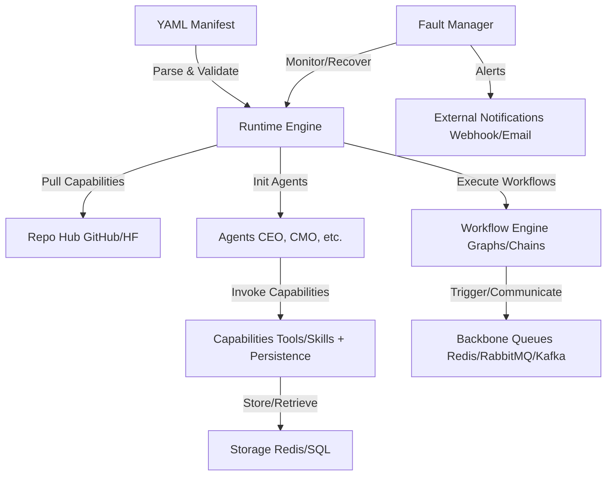
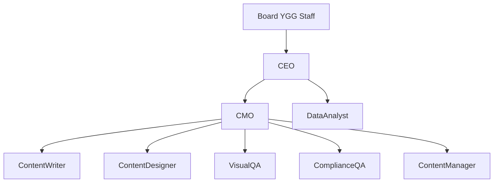
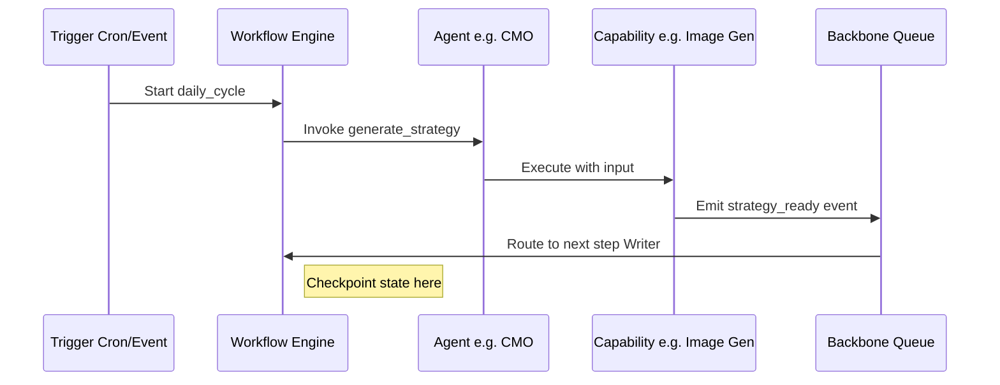
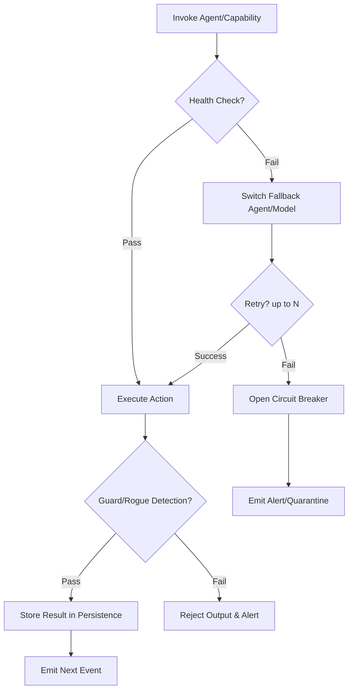

Technical Implementation Plan for Declarative Agentic Orchestration Framework (DAOF)
This document provides a detailed technical implementation plan for DAOF, building on the PRD. It locks down data types, structures, and schemas using TypeScript interfaces and Zod for validation. The plan is phased for incremental development, with code snippets in TypeScript (Node.js). Fault tolerance is integrated throughout, with mechanisms for rogue/offline agents (e.g., guards, retries, fallbacks, and dead-letter queues).
Diagrams are provided in MermaidJS syntax. You can copy these into tools like mermaid.live or VS Code extensions for rendering. I've included 4 key diagrams: System Architecture, Org Structure, Workflow Execution, and Fault Tolerance Flow.
1. Overview
DAOF is a TypeScript/Node.js framework that parses a YAML manifest to bootstrap an autonomous org. Key components:

YAML Parser & Validator: Loads and validates the manifest.
Capability Puller: Fetches from repos (GitHub/Hugging Face).
Agent Runtime: Instantiates agents as LLM wrappers with capabilities.
Workflow Engine: Executes graphs/chains with triggers.
Backbone Manager: Handles queues for comms/persistence.
Fault Manager: Monitors and recovers from issues.

Tech Stack:

Core: TypeScript (v5+), Node.js (v20+).
Libs: yaml (parsing), zod (validation), simple-git (repo pulling), ioredis (queues), langgraph.js (graphs), cron (triggers), ts-retry-promise (retries), p-circuit-breaker (breakers).
Deployment: Docker Compose for local
Data Types: Locked to primitives (string, number, boolean), arrays, objects/maps. No unions for simplicity in v1.

Assumptions:

LLM providers (e.g., Grok API) handled via env vars.
Persistence defaults to backbone queues + optional SQL (your events table).
Security: Capabilities sandboxed (e.g., no fs access unless explicit).

2. YAML Schema & Data Structures
The YAML manifest is the single source of truth. We use Zod for runtime validation to ensure type safety.

2.1 Manifest v1 spec (canonical)
The following is the locked v1 spec. The canonical example lives in the repo [readme.md](../readme.md) org.yaml block. All Zod schemas and tests must align with this.

**Root keys** (order for clarity only; YAML is unordered):

| Key               | Required | Description                                                    |
| ----------------- | -------- | -------------------------------------------------------------- |
| `version`         | Yes      | String, schema version (e.g. `"1.0"`) for future compatibility |
| `org`             | Yes      | Object: org metadata                                           |
| `agents`          | Yes      | Map: agent id → agent config                                   |
| `capabilities`    | Yes      | Map: capability id → capability config                         |
| `workflows`       | Yes      | Map: workflow id → workflow config                             |
| `backbone`        | Yes      | Object: queue type and config                                  |
| `fault_tolerance` | No       | Object: health, rogue detection, retries, alerts               |

**Nesting and constraints:**

- **org:** `name` (string, min 1), `description` (string, optional), `goals` (array of strings; e.g. `stay_under_monthly_budget: 1500` allowed as one string).
- **agents** (map: string → Agent): `model`, `role` (strings, min 1); `description`, `fallback` (string, optional); `capabilities` (array of `{ name: string }` referencing top-level `capabilities`); `max_concurrent_tasks` (number, optional).
- **capabilities** (map: string → Capability): `type` (`"tool"` \| `"skill"` \| `"hybrid"`); `description`, `config` (record), `persistence`, `rate_limit`, `source`, `prompt`, `guards` (array of strings) all optional where not required.
- **workflows** (map: string → Workflow): `trigger` (string); `description`, `persistence` (e.g. `sql_events`, `redis`) optional; `steps` (array of Step).
- **Step:** Either sequential — `agent`, `action` (strings), `on_failure`, `params` (record), `condition` (string) optional — or parallel: `parallel` (array of sequential steps; no nested parallel in v1).
- **backbone:** `type` (`"redis"` \| `"rabbitmq"` \| `"kafka"`); `config`: `url` (string), `queues` (array of `{ name: string, type: "pubsub" \| "fifo" }`).
- **fault_tolerance** (all optional): `health_checks_interval` (string), `rogue_detection` (array of string or object), `retries` (`{ default, backoff }`), `circuit_breaker` (`{ threshold, reset_after }`), `dead_letter_queue` (boolean), `alerts` (`{ webhook?, channels? }`).

2.2 Zod implementation
The canonical implementation lives in **`src/schema/index.ts`**. It implements the Manifest v1 spec above. Main exports:

- **OrgSchema** — root Zod schema (validates `version`, `org`, `agents`, `capabilities`, `workflows`, `backbone`, `fault_tolerance`).
- **OrgConfig** — TypeScript type inferred from OrgSchema (`z.infer<typeof OrgSchema>`).
- Sub-schemas: AgentSchema, CapabilityDefinitionSchema, WorkflowSchema, StepSchema (sequential and parallel), BackboneSchema, FaultToleranceSchema.

Use these types for all parser output and runtime config. Example usage:

```typescript
import { loadYaml } from './parser/index.js';
import { validate, OrgConfig } from './schema/index.js';

const raw = loadYaml('org.yaml');
const config: OrgConfig = validate(raw);
```

Data Structures in Runtime: Use the inferred TS types (e.g., OrgConfig) for all internal objects. Capabilities store as Map<string, CapabilityInstance> where CapabilityInstance has execute: async (input: any) => any.

3. Runtime Components & Implementation Details
Parser & Validator:

Load with yaml.load(fs.readFileSync(file)).
Validate: OrgSchema.parse(config).
Error handling: Throw with detailed messages (e.g., "Invalid capability type at agents.cmo.capabilities[0]").

Capability Puller:

For each capability with source: Use simple-git to clone --depth 1 --single-branch {source} temp_dir.
Load as TS module: import capability from './temp_dir/index.ts'.
Instantiate: capability.execute = async (input) => { /* wrapped with guards */ }.
Persistence: If 'redis', attach Redis client to store/retrieve (e.g., redis.set(key, JSON.stringify(result))).

Agent Runtime:

Agents as classes:TypeScript
```typescript
class Agent {
  private model: string;
  private capabilities: Map<string, CapabilityInstance>;
  constructor(config: AgentConfig) { /* init */ }
  async invoke(action: string, input: any): Promise<any> {
    // Guard check, then execute capability or LLM call
  }
}
```
LLM calls: Use provider libs (e.g., @xai/grok-api for Grok).

Workflow Engine:

Use LangGraph.js for graphs: Parse steps into nodes/edges.
Triggers: Node-Cron for cron; queue listeners for events.
Execution: graph.run({ input }), with checkpoints (persist mid-workflow state to backbone).

Backbone Manager:

Init based on type: e.g., new Redis(url) for pub/sub.
Agents subscribe: redis.on('message', (channel, msg) => { if (channel === 'events') processEvent(msg); }).
Emit: redis.publish('events', JSON.stringify(event)).

Fault Manager:

Health Checks: Cron job pings agents (e.g., dummy LLM call). If fails > threshold, switch fallback.
Rogue Detection: Post-invoke, run guard LLM (e.g., "Score output for hallucination: 0-1"). If >0.7, reject and alert.
Retries: Wrap invokes with ts-retry-promise.
Circuit Breakers: Use p-circuit-breaker to "open" on repeated fails.
Dead-Letter: Failed events to separate queue (e.g., redis.lpush('dlq', event)).

4. Diagrams (MermaidJS)
Copy these into mermaid.live for visualization.
4.1 System Architecture (Component Diagram):


4.2 Org Structure (Graph Diagram):


4.3 Workflow Execution (Sequence Diagram):


4.4 Fault Tolerance Flow (Flowchart):


5. Phased Implementation Plan
Phase 1: Core Parser & Schema (1–2 days)

Implement Zod schema + basic parser.
Code Snippet: As above.

Phase 2: Capability Puller & Agents (2–3 days)

Add repo fetching + agent instantiation.
Test: Pull a dummy tool from GitHub, invoke.

Phase 3: Workflow Engine & Backbone (3–4 days)

Integrate LangGraph.js for graphs; add queue clients.
Code Snippet for Queue Emit: await redis.publish(queueName, JSON.stringify({ type: 'event', payload })).

Phase 4: Fault Tolerance (2–3 days)

Add health cron, guards (small LLM call), retries/breakers.
Code Snippet for Guard: const score = await guardLLM.invoke(Score for hallucination: ${output}); if (score > 0.7) throw new Error('Rogue detected');.

Phase 5: Testing & Polish (2 days)

Unit: Zod validation, capability exec.
Integration: Run sample YAML, simulate offline/rogue.
Deployment: Docker Compose file with runtime + Redis.

Total: ~10–15 days for MVP.
This plan is locked-down and ready to build. If you want code repo setup advice or expansions (e.g., full Docker Compose file), let me know!