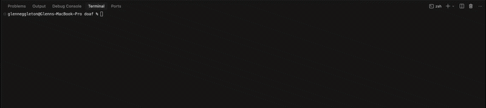

# DAOF — Declarative Agentic Orchestration Framework

<image-card alt="DAOF" src="https://img.shields.io/badge/DAOF-v0.1-orange" ></image-card>
<image-card alt="License" src="https://img.shields.io/github/license/geggleto/daof" ></image-card>
<image-card alt="Stars" src="https://img.shields.io/github/stars/geggleto/daof?style=social" ></image-card>
<image-card alt="Forks" src="https://img.shields.io/github/forks/geggleto/daof?style=social" ></image-card>



**Build and run autonomous AI organizations from a single YAML manifest.** No glue code. No babysitting.

---

## What DAOF does

- **Define once, run forever** — Agents, capabilities (tools/skills), and workflows live in one org manifest. Cron and event-triggered workflows run on a scheduler; the org stays in memory and syncs back to the file on shutdown.
- **Generate from natural language** — Use `daof build "add a summarizer skill"` to produce a PRD, generate capabilities/agents/workflows, merge into your org, and verify. Optional codegen for new tools.
- **Plan interactively** — Use `daof plan` to develop a PRD with the Planner, revise it, then execute the full build or save for later.
- **Trigger builds from a running org** — Run `daof run org.yaml` as a daemon, then `daof build "..." --via-events` to publish a build request; the running org executes the build and replies.
- **Registry and curation** — Sync your org to a MongoDB registry for metadata search and duplicate detection. Use the Curator agent and `prune_registry` to archive stale entries. Query by tags or category from the CLI or via the `query_capability_registry` capability.
- **Observability and control** — Run workflows one-shot or the full scheduler, detach with a PID file, cancel runs with `daof kill`, and use middleware (e.g. agent metrics) for step-level visibility.

Requires **Node 20+**. LLM provider: Cursor for MVP (set `CURSOR_API_KEY`). Redis required for `daof run` (scheduler and events).

---

## Quick start

### 1. Install

```bash
npm install -g daof
```

Or in a project: `npm install daof` and run via `npx daof` or `node_modules/.bin/daof`.

### 2. Environment

The CLI loads `.env` and `.env.local` from the current working directory (via dotenv). Set `CURSOR_API_KEY`, `REGISTRY_MONGO_URI`, etc. there, or export them in the shell.

- **Cursor (LLM):** `CURSOR_API_KEY` for plan, build, and agent steps.
- **Redis:** Used by the scheduler and event workflows. Set in the org manifest (e.g. `backbone.config.url: redis://localhost:6379`) or use a hosted Redis URL.
- **Registry (optional):** `REGISTRY_MONGO_URI` or `MONGO_URI` (or `registry.mongo_uri` in the manifest) for the skills/capabilities registry.

### 3. Start Redis (for `daof run`)

From the repo root:

```bash
docker compose up -d
```

Or use a hosted Redis and set the URL in your manifest.

### 4. Validate and run

```bash
daof validate org.yaml
daof run org.yaml
```

Without `--workflow`, the org runs as the long-running scheduler (heartbeat + cron + event subscriber). The manifest is kept in memory; changes from workflows (e.g. build-on-request) are written back to the file on shutdown (SIGINT/SIGTERM). See [Daemon mode](docs/workflow-engine.md#daemon-mode-in-memory-org-sync-on-shutdown).

---

## CLI reference

Every command is run via the `daof` CLI. Below is an example of each command and its main options.

### Validate

Check that an org manifest is valid YAML and passes schema validation.

```bash
daof validate org.yaml
```

Example output: `Valid. (org: MyOrg).`

---

### Run

Load, validate, bootstrap, and either run the **scheduler** (all cron and event workflows) or a **single workflow** once.

**Run the org (scheduler):**

```bash
daof run org.yaml
```

**Run one workflow (one-shot):**

```bash
daof run org.yaml --workflow hourly_metrics
```

**Run in background (scheduler only):**

```bash
daof run org.yaml -d
daof run org.yaml --detach --pid-file /var/run/daof.pid
```

**Verbosity:**

```bash
daof run org.yaml -v
daof run org.yaml --workflow build_on_request -vvv
```

| Option | Description |
|--------|-------------|
| `--workflow <name>` | Run the named workflow once and exit. Omit to run the scheduler. |
| `-d`, `--detach` | Run the scheduler in the background (only when not using `--workflow`). |
| `--pid-file <path>` | PID file when using `-d` (default: `daof.pid` in cwd). |
| `-v`, `--verbose` | Increase verbosity; `-vvv` prints workflow output JSON. |

---

### Build

Generate capabilities, workflows, and agents from a natural-language description. Planner → review (unless `--yolo` or `--via-events`) → Generator → similarity check → merge → validate → write → optional codegen → Verifier.

**Basic build (interactive review):**

```bash
daof build "Add a capability that summarizes text"
```

**Skip review:**

```bash
daof build "Add a summarizer skill" --yolo
```

**Target a specific org file:**

```bash
daof build "Add an image generator" --file ./my-org.yaml
```

**Trigger build on a running org (no local review):**

```bash
daof build "Add a new workflow for weekly reports" --via-events
```

**Disable codegen / custom codegen dir:**

```bash
daof build "Add a logger capability" --no-codegen
daof build "Add a custom tool" --codegen-dir ./my-capabilities
```

**Add generated capability to framework source (repo root):**

```bash
daof build "Add a principal-level frontend code writer" --yolo --bundle
```

| Option | Description |
|--------|-------------|
| `--file <path>` | Org manifest to update (default: `org.yaml`). |
| `--yolo` | Skip PRD review and proceed immediately. |
| `--provider <id>` | LLM provider (default: `cursor`). |
| `--via-events` | Publish `build.requested` and wait for reply from running org. |
| `--no-codegen` | Disable capability source code generation. |
| `--codegen-dir <path>` | Directory for generated sources (default: `generated/capabilities`). |
| `--bundle` | Write capability into `src/capabilities/bundled` and register (run from repo root). |
| `-v`, `--verbose` | Verbosity; `-vv` parse/summary, `-vvv` raw LLM output. |

---

### Plan

Interactively develop a PRD with the Planner. Optionally revise, save, or execute the full build.

**Interactive (prompt for description, then menu):**

```bash
daof plan
daof plan "Add a metrics dashboard capability"
```

**One-shot PRD (no menu):**

```bash
daof plan "Add a summarizer" --no-edit
```

**One-shot PRD and run full build:**

```bash
daof plan "Add a summarizer" --no-edit --execute
```

**Custom org file and provider:**

```bash
daof plan --file ./org.yaml --provider cursor
```

| Option | Description |
|--------|-------------|
| `--file <path>` | Org manifest for context and execute (default: `org.yaml`). |
| `--provider <id>` | LLM provider (default: `cursor`). |
| `--no-edit` | Print PRD and exit (no interactive loop). |
| `--execute` | With `--no-edit`: run the full build with the generated PRD. |
| `-v`, `--verbose` | Verbosity. |

---

### Registry

Sync the org to the skills/capabilities registry (MongoDB) or query by tags/category.

**Sync org to registry:**

```bash
daof registry sync
daof registry sync --file org.yaml
```

**Query by tags:**

```bash
daof registry query --tags "image,http"
```

**Query by category:**

```bash
daof registry query --category content
```

**List all:**

```bash
daof registry query
```

| Command | Option | Description |
|---------|--------|-------------|
| `registry sync` | `--file <path>` | Org manifest to sync (default: `org.yaml`). |
| `registry query` | `--tags <list>` | Comma-separated tags. |
| `registry query` | `--category <name>` | Category name. |

---

### Kill

Cancel a running workflow by run ID (requires Redis run registry).

```bash
daof kill <run_id> org.yaml
```

Example: `daof kill abc-123 org.yaml`

---

## Manifest overview

The org manifest is a YAML file with:

- **org** — Name, description, goals.
- **agents** — LLM-backed agents (provider, model, role, capabilities list).
- **capabilities** — Tools, skills, or hybrids (type, description, config, optional `depends_on`, `source`, `persistence`).
- **workflows** — Named workflows with `trigger` (e.g. `cron(0 9 * * *)` or `event(build.requested)`) and `steps` (agent + action, optional params, conditions, parallel blocks).
- **backbone** — Queue adapter (e.g. Redis) and queue definitions.
- **registry** (optional) — MongoDB URI for the skills/capabilities registry.
- **middleware** (optional) — Agent/capability middleware (e.g. `agent_metrics`).

Validate with `daof validate org.yaml`. See [docs/workflow-engine.md](docs/workflow-engine.md), [docs/capabilities.md](docs/capabilities.md), and [docs/registry.md](docs/registry.md) for details. Example manifests: [org.yaml](org.yaml) (canonical), [examples/](examples/).

---

## Documentation

| Doc | Description |
|-----|-------------|
| [AGENTS.md](AGENTS.md) | Entry point for AI agents; project layout and API reference. |
| [docs/workflow-engine.md](docs/workflow-engine.md) | Workflow engine, triggers, daemon mode, runWorkflow. |
| [docs/capabilities.md](docs/capabilities.md) | Capabilities, depends_on, invokeCapability, skills. |
| [docs/build-flow.md](docs/build-flow.md) | Build flow (Planner, Generator, merge, Verifier, event mode). |
| [docs/build-events.md](docs/build-events.md) | build.requested, build.replies, payloads. |
| [docs/registry.md](docs/registry.md) | Registry, staleness, prune_registry, Curator. |
| [docs/backbone.md](docs/backbone.md) | Backbone (queues), Redis, semaphore, run registry. |
| [docs/authentication.md](docs/authentication.md) | Auth for external capabilities. |
| [docs/verification.md](docs/verification.md) | Requirements traceability and verification. |
| [docs/prd.md](docs/prd.md), [docs/tip.md](docs/tip.md), [docs/backlog.md](docs/backlog.md) | Product and backlog. |

---

## Contributing

We want DAOF to become the standard way to define agentic systems. PRs welcome: new capabilities, backbone adapters, or fixes. See [AGENTS.md](AGENTS.md) for structure and types.

---

## License

MIT. Built with care by @geggleto and community. Star the repo if you want agent orchestration to be boringly reliable.
